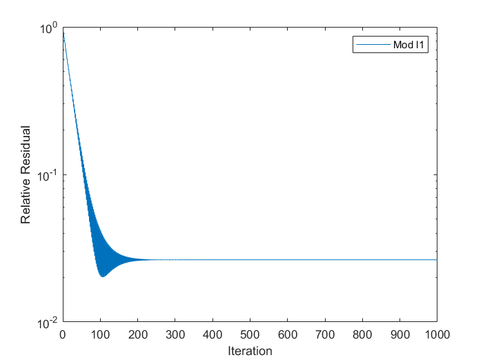
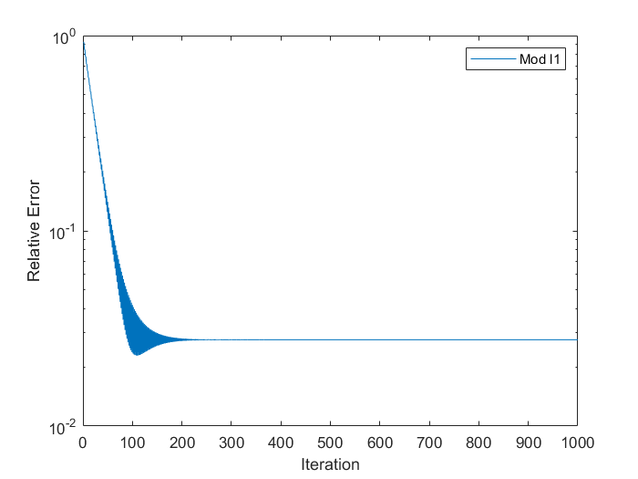
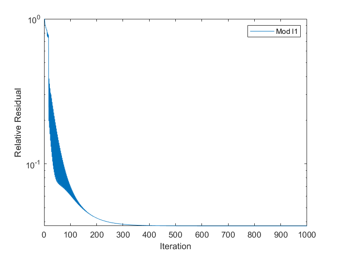
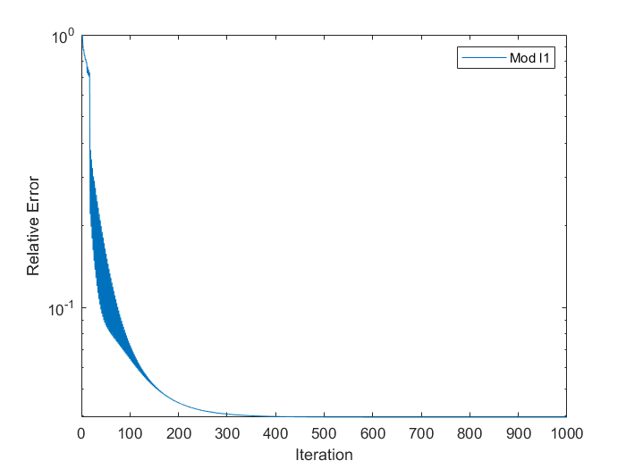
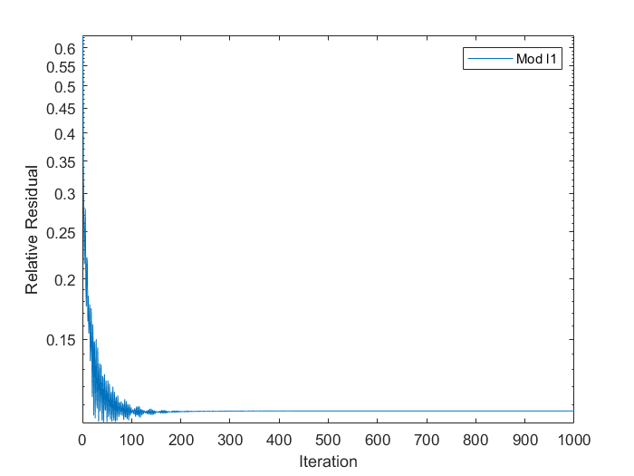
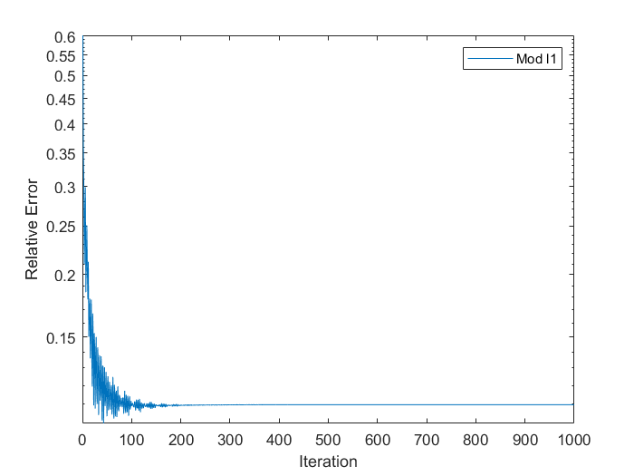
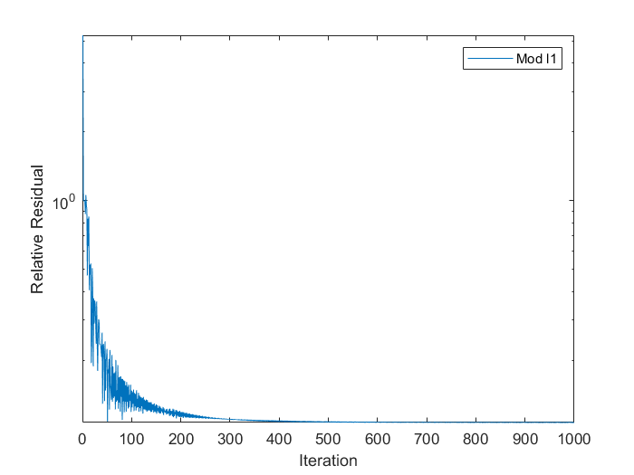
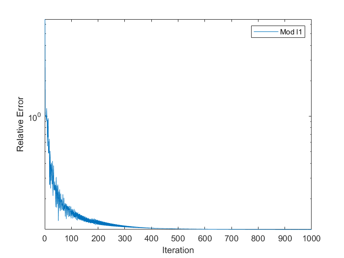

[TOC]

### 算法简述
#### 目标函数
$$
\min \|x\|_1^2+\|Ax-b\|_2^2,\\
\text{s.t. } x\geq0.
$$
#### 迭代格式
迭代格式为

$$
(I + \tilde{A}^{\top}\tilde{A})z^{k+1}=(I - \tilde{A}^{\top}\tilde{A})|z^k|+\tilde{A}^{\top}b,
$$

其中

$$
\tilde{A}=
\begin{bmatrix}
A\\
c
\end{bmatrix},
$$

$c$ 是全一的行向量。

### 数值实验

#### 实验环境
个人笔记本 + MATLAB R2022(a)
#### 测试例子
##### 小规模超定
$A\in\mathbb{R}^{32\times64}$,由MATLAB函数randn生成。真解$\hat x$为由MATLAB函数sprand生成稀疏度为0.1的随机向量。

* 初值为零向量。

* 初值为$A^{\top}d$,其中$d$为全1向量。

##### 小规模欠定
$A\in\mathbb{R}^{64\times32}$,由MATLAB函数randn生成。真解$\hat x$为由MATLAB函数sprand生成稀疏度为0.1的随机向量。

* 初值为零向量。

* 初值为$A^{\top}d$,其中$d$为全1向量。

这四个实验中算法无法收敛到给定的真解,猜测可能不会收敛到稀疏的解。

[back](./)

